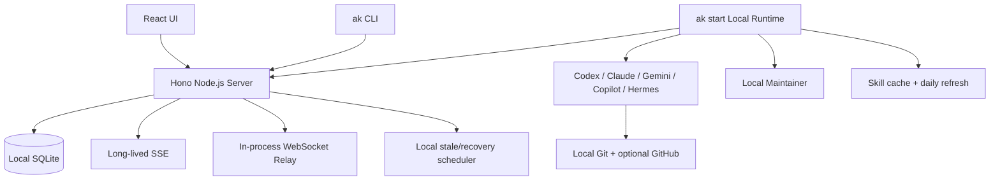

# Agent Kanban 纯本地化：移除 Cloudflare、AMA 与托管邮箱

状态：**仅计划，尚未实施**

本文档只定义实施方案。执行时不得跳过数据备份、迁移预检或分阶段验收；不得把旧 Wrangler 数据库原地改写为新数据库。

## 1. 目标与源码结论

当前残留依赖不是两个孤立模块，而是四组相互耦合的运行时能力：

- Cloudflare：Vite 插件、Worker 入口、D1、Durable Object WebSocket、Cron、Analytics Engine、Email Binding、Wrangler 和 Miniflare。
- AMA：任务路由、云端 session、cloud machine、模型目录、OIDC、maintainer trigger/memory/vault、CLI runner 和前端聊天分支。
- 托管邮箱：`mails.agent-kanban.dev` 的 Agent 邮箱、收件箱及 GitHub 邮箱同步。
- 已有本地能力：`ak start` daemon、任务轮询、provider 启动、PR 监控、本地 maintainer scheduler、skill 缓存与每日刷新。这部分保留并作为唯一执行面。

目标是把项目改成模块化本地单体：



目标运行时不需要 Cloudflare、Wrangler、workerd、Miniflare、AMA 或托管邮箱；安装依赖完成后，除显式配置的 GitHub/模型服务外，核心看板、认证、任务调度、聊天和 maintainer 可以在断网环境运行。

## 2. 架构决策记录

### ADR-001：采用 Node.js 模块化单体

- **状态**：Accepted。
- **背景**：当前 React、Hono、认证、SQLite 数据和本地 daemon 都服务于单机或 LAN，不需要独立扩缩容；继续使用 Worker 会保留 vendor runtime。
- **决定**：使用 Node.js 22+ 与 `@hono/node-server`，生产环境由一个进程提供 API、WebSocket 和 React 静态资源；开发环境由 Vite 代理到 Node API。
- **替代方案**：保留 Miniflare 被否决，因为仍依赖 workerd/Cloudflare 语义；拆成微服务被否决，因为会增加本地部署、进程管理和故障排查成本。
- **后果**：部署和调试更简单；单进程退出会同时影响 UI/API/relay，因此必须实现 graceful shutdown、数据目录级单实例锁和明确的健康检查。

### ADR-002：使用 `better-sqlite3` 与项目自有数据库契约

- **状态**：Accepted。
- **背景**：仓储层大量使用 D1 的 `prepare/bind/all/first/run/batch`，直接改写所有 SQL 风险高；Better Auth 官方 SQLite 适配支持 `better-sqlite3`。
- **决定**：定义 `AppDatabase` 契约并用 `better-sqlite3` 实现 D1 子集语义；同一 SQLite 文件服务业务表和 Better Auth。
- **替代方案**：`node:sqlite` 暂不采用，以避免与 Better Auth 适配生态产生额外兼容层；全量 Kysely 重写被否决，因为迁移范围过大且不能改善本地产品行为。
- **后果**：可以渐进替换 D1；需要自行保证 `batch()` 原子性、结果 metadata、连接关闭、WAL、busy timeout 和 native module 发布兼容性。

### ADR-003：旧 D1 只读导入，不原地升级

- **状态**：Accepted。
- **背景**：旧库含本地业务数据、Better Auth、AMA 资源和 cloud machine；原地删表会降低回滚能力，且新安装不应先创建 AMA schema 再删除。
- **决定**：为纯本地版本创建新 baseline；迁移命令从 Wrangler SQLite 读取并导入新库，先备份和校验，旧库保持不变。
- **替代方案**：原地 migration 被否决，因为难以安全回滚；完全丢弃旧数据被否决，因为用户要求迁移现有本地数据。
- **后果**：磁盘会暂时保留两个数据库；换取可验证、可重复、可回退的数据迁移。

### ADR-004：核心离线，GitHub App 为可选外部集成

- **状态**：Accepted。
- **背景**：用户要求保留 GitHub App，但本地服务通常没有公网 webhook 地址。
- **决定**：GitHub App、OAuth 绑定、installation token 和签名 webhook 仅在配置后启用；daemon 的 `gh` PR 轮询和 GitHub Events API 轮询提供无 webhook 兜底。
- **替代方案**：强制公网 tunnel 被否决，因为会把本地核心重新绑定外部基础设施；完全删除 GitHub 被否决，因为会损失仓库发现和 App token 能力。
- **后果**：实时 webhook 需要用户自备公网反向代理或 tunnel；未配置 GitHub 时不得发生隐式 GitHub 请求。

## 3. 分阶段实施方案

### 阶段 0：冻结基线与迁移预检

1. 保留并隔离当前未提交的 local runtime、认证和 maintainer 工作，不覆盖用户已有改动。
2. 记录当前 revision、测试基线、旧 D1 路径和关键表行数。
3. 统计：
   - active/terminal AMA-bound tasks；
   - AMA maintainers、cloud machines、AMA OAuth accounts；
   - 本地 `agent_sessions`、boards、tasks、agents、repositories、API keys 和 users。
4. 实现前先确定新数据目录、数据库文件和服务锁路径；默认：
   - 数据目录：`${XDG_DATA_HOME:-~/.local/share}/agent-kanban`；
   - 数据库：`agent-kanban.sqlite`；
   - 可由 `AK_DATA_DIR`、`AK_DATABASE_PATH` 覆盖；
   - 服务锁放在数据目录，防止不同 checkout 同时写同一数据库。

退出条件：实现从已知 revision 和已知数据清单开始，旧数据库有明确恢复路径。

### 阶段 1：建立平台无关边界

1. 将 `D1Database` 替换为项目自有 `AppDatabase`：
   - prepared statement 与位置参数；
   - `all`、`first`、`run`；
   - `meta.changes` 等现有调用所需结果；
   - 原子 `batch`/transaction；
   - migration version 查询。
2. 先提供 D1 兼容包装和 SQLite 实现，使业务仓储可以分步迁移，不要求一次性改写全部 SQL。
3. 把 Worker `Env` 拆成 `AppServices`：database、config、relay、metrics、background tasks、GitHub clients。
4. 将 Hono 导出改成 `createApi(services)`，删除业务代码对 Cloudflare binding、`ExecutionContext` 和 `waitUntil()` 的直接依赖。
5. SQLite 初始化必须启用：
   - `PRAGMA foreign_keys = ON`；
   - WAL；
   - 5 秒 busy timeout；
   - 关闭流程中的 checkpoint 与 connection close。

退出条件：repo 和 route 不再直接导入 Cloudflare 数据库或执行上下文类型；数据库契约测试覆盖 batch 回滚和 task claim 原子性。

### 阶段 2：增加纯 Node 运行时

1. 新增 Node server 入口：
   - 默认监听 `127.0.0.1`；
   - 只有显式 `AK_HOST=0.0.0.0` 才开放 LAN；
   - 生产环境同一端口提供 API、WebSocket、share/badge 和 SPA 静态资源；
   - 未命中静态资源时回退 `index.html`，API/认证路径不参与 SPA fallback。
2. 开发环境由 Vite 提供 HMR，并代理 `/api`、`/.well-known`、`/agents`、`/share` 和 WebSocket 到 Node server。
3. 将 Durable Object relay 改成进程内 relay hub：
   - daemon 连接按 `machineId` 保存，同一机器新连接替换旧连接；
   - browser 根据 `agent_sessions.machine_id` 路由到正确机器；
   - upgrade 前验证用户、Machine API Key、owner 和 session 归属；
   - 保留 ping/pong、历史请求、聊天消息、agent event/status 和重连协议；
   - 进程退出时发送关闭原因并清空定时器。
4. SSE 改成长连接：
   - 保留 `Last-Event-ID` 和 SQLite 补读；
   - 增加心跳与 request abort 清理；
   - 删除 Cloudflare 25 秒连接上限；
   - 继续使用有上限的历史读取，避免断线重连放大查询。
5. Worker Cron 改为非重入 Node scheduler，只负责：
   - machine stale；
   - task stale/recovery；
   - 本地 agent session 清理。
   Maintainer 调度继续由 `ak start` 内的 `LocalMaintainerScheduler` 承担，服务端不得再启动第二套 maintainer 定时器。
6. Analytics Engine 改为进程内五分钟滚动指标，继续输出 Admin Machines 所需的 QPS、错误率、平均延迟和请求数；进程重启后归零。
7. 重写 package scripts、`service_runner.sh` 和 systemd unit，使它们只管理 Node server 与可选的 `ak start`，不再创建 `.dev.vars`、调用 Wrangler 或访问 `.wrangler/state`。

退出条件：完整应用在不启动 workerd/Miniflare 的情况下支持 HTTP、认证、SSE、WebSocket、静态资源和本地 scheduler。

### 阶段 3：删除 AMA 双轨运行时

1. 删除 AMA SDK、`amaRuntime.ts`、owner integration、runner download/device login、vault、trigger、memory、cloud session 和 cloud environment 代码。
2. `ak start` 删除 `--mode ama`、AMA runner 状态和 AMA credential 文件；始终启动本地 daemon。
3. 子进程环境改成显式允许列表，避免依靠 `AMA_*`、`CF_*` 黑名单保护控制面 Secret。
4. Shared types：
   - 从 `AgentRuntime`、运行时数组和标签移除 `ama`；
   - 删除 `MachineHosting = cloud`、`CLOUD_AGENT_RUNTIMES`、AMA 注解常量和 AMA ID；
   - 删除 `runtime.source = ama|legacy`，所有任务只存在本地执行面。
5. 任务分配只检查本地 machine heartbeat、runtime/model readiness、quota 和 relay 配置；删除 AMA 优先、fallback、dispatch claim 和云端 session 创建。
6. model catalog 只聚合本地 heartbeat 上报的模型、能力和 reasoning efforts。
7. 删除 API：
   - `POST /api/ama/provision`；
   - `POST /api/machines/cloud`；
   - `/api/sessions*`；
   - `/api/tasks/:id/session`；
   - `/api/tasks/:id/session/ws`。
8. 保留本地 `/api/agents/:agentId/sessions*`、`/api/tunnel/ws`、task/board SSE 和本地 chat。
9. 删除 AMA OIDC、cloud sandbox、AMA connect/provision、cloud quota/catalog 和 AMA chat provider UI。

退出条件：创建、分配、执行、release、reject、complete 和 chat 均不会构造 AMA 请求；CLI 和 UI 中不存在 AMA 模式。

### 阶段 4：完成 Local Maintainer 替代

1. 创建租户级只读内置 `Local Maintainer` Agent：不可删除、不可编辑为普通 worker、不可接收普通任务。
2. `board_maintainers` 保存本地 `runtime`、可空 `model`、heartbeat/review/GitHub event 开关和状态，不再保存 AMA schedule、HTTP trigger、vault 或 memory-store ID。
3. 新增：
   - `maintainer_runs`：触发来源、幂等键、routing key、状态、租约、机器、session、错误和时间；
   - `maintainer_sessions`：GitHub issue/PR routing key、机器亲和性、状态和最后运行时间；
   - `maintainer_memories`：安全相对路径、UTF-8 内容、hash、revision 和更新时间；
   - `maintainer_event_cursors`：GitHub Events API 的 ETag、事件游标、下次轮询时间和错误。
4. GitHub webhook 和 daemon 轮询进入同一规范化、幂等队列；首次轮询只建立基线，不重放历史事件。
5. 同一 maintainer 同时只运行一个 turn；同一 issue/PR 复用 provider session，heartbeat 每次使用临时 session。
6. Memory 拒绝绝对路径、`..`、symlink 和保留目录；限制 500 文件、单文件 1 MiB、单 board 10 MiB；以 revision 条件写入，冲突时不覆盖。
7. 内置 `ak-maintainer` skill 随 CLI 打包；使用平台 skill 能力每 24 小时检查更新：
   - staging 校验完整目录、路径、symlink 和大小；
   - 按内容 hash 原子发布；
   - 当前运行固定使用启动时快照；
   - 更新失败使用 last-known-good；无缓存时回退内置版本。
8. 新 Local Maintainer 不再用系统任务模拟 run；只有 maintainer 发现的实际工作才创建普通任务。

退出条件：heartbeat、review、GitHub event、session resume、memory 和 skill 更新均完全本地运行，不产生 AMA 请求。

### 阶段 5：用户名认证与托管邮箱移除

1. 启用 Better Auth username 登录：
   - 零用户时开放一次 bootstrap 注册；
   - 首个账号原子创建为 admin 并立即登录；
   - 注册完成后永久关闭公开注册；
   - 用户名大小写不敏感并全局唯一；
   - 不要求邮箱、不发送验证邮件。
2. Better Auth 内部继续保存不可见的合成邮箱以满足 credential 约束，但 UI、API 和身份文案不再把邮箱作为用户名。
3. 新增：
   - `GET /api/auth/bootstrap/status`；
   - `POST /api/auth/bootstrap/register`；
   - `PUT /api/auth/username`；
   - 仅旧账号过渡使用的 `POST /api/auth/sign-in/legacy-email`。
4. 阻止公开邮箱注册、邮箱登录、验证邮件、验证链接和 GitHub social login；登录后仍可绑定 GitHub。
5. 删除 Cloudflare Email binding、`emailService.ts`、`MAILS_ADMIN_TOKEN`、`mailsService.ts`、Agent inbox API/UI 和 mailbox token。
6. Agent 增加可选 `git_email`：
   - 默认 `${username}@agent-kanban.local`；
   - 用户可填写自己控制且已在 GitHub 验证的邮箱；
   - 保留 GPG/Ed25519 身份，但不再自动向 GitHub 添加或删除 Agent 邮箱。

退出条件：首次部署只需用户名、显示名称和密码；运行时不会调用邮件发送或托管邮箱服务。

### 阶段 6：保留可选 GitHub App

1. 保留 App installation、installation token、repository discovery、setup callback 和签名 webhook。
2. 只有配置 `GITHUB_APP_ID`、private key 等必要值时才启用对应能力；配置缺失时返回稳定的 disabled 状态，不进行网络调用。
3. webhook 公网地址由用户自备反向代理或 tunnel，不内置 Cloudflare tunnel。
4. `PrMonitor` 的 `gh` 轮询始终保留为 task 完成/取消兜底；Local Maintainer 用 GitHub Events API + ETag 在无 webhook 时补齐事件。
5. GitHub OAuth 只允许登录后绑定，用于用户级可选能力，不允许绕过首次部署注册创建账号。

退出条件：GitHub 完全未配置时核心功能和测试正常；配置后 webhook、App token 与轮询可独立降级。

### 阶段 7：导入旧 Wrangler/D1 数据

新增显式命令：

```bash
pnpm local:migrate --from-wrangler [--source <sqlite>]
```

迁移流程：

1. 自动定位或显式读取 `.wrangler/state/v3/d1/**/*.sqlite`。
2. 创建权限 `0600` 的完整备份并记录 SHA-256；备份包含 Secret，不得写入仓库。
3. 创建脱敏 AMA manifest，记录远端资源 ID、状态和数量，不输出 access token、refresh token、private key 或 credential secret。
4. 创建全新的纯本地 SQLite baseline，再导入：
   - users、credential accounts、sessions；
   - GitHub account/installations；
   - Machine API keys 和 Agent Auth 数据；
   - boards、tasks、actions、messages、agents、repositories、settings、skills；
   - local machines 和现有 `agent_sessions`。
5. AMA 数据处理：
   - `ama_agent_sessions`、`ama_owner_integrations`、AMA OAuth account、vault/trigger/memory/cloud machines 只进入完整备份和 manifest；
   - terminal AMA task 保留卡片、actions 和 messages，但清除功能性 AMA binding；
   - active AMA task 改为 `error`、清空 assignee，记录 `runtime_removed`，必须手动 retry；
   - AMA maintainer 转为 local maintainer；原 runtime 不是本地 runtime 时保持 paused；
   - 迁移过程不调用 AMA，也不尝试远程删除资源。
6. 旧账号生成唯一用户名；旧邮箱账号在确认用户名前允许一次性兼容登录，确认后真实邮箱替换为内部占位值。
7. 导入完成后验证外键、索引、migration version 和关键表行数；以 read-only verification 启动检查 API 数据。
8. 迁移失败时删除未完成的新库；不得改写或删除源库和备份。
9. 已存在目标数据库时默认拒绝覆盖；重复执行必须显式指定新的目标路径。

重要约束：现有 `agent_sessions` 已经是本地 session 表，必须保留；`ama_agent_sessions` 是 AMA 专属表，只导出，不得重命名覆盖 `agent_sessions`。

退出条件：本地账号、会话、API key、boards、tasks、agents、machines、repositories 和 local sessions 可用，旧库仍可恢复。

### 阶段 8：删除 Cloudflare/AMA 构建与文档遗留

仅在 Node/SQLite 运行时和数据导入验收通过后执行：

1. 删除 Worker entry、Wrangler 配置、Durable Object relay、Cloudflare metrics client 和部署脚本。
2. 删除依赖：
   - `@cloudflare/vite-plugin`；
   - `@cloudflare/workers-types`；
   - `wrangler`；
   - `kysely-d1`；
   - AMA SDK 和 AMA runner 依赖。
3. 清理 Cloudflare/AMA/mailbox 的环境变量、test mocks、smoke modes、CI deploy、landing page、`llms*.txt` 和活跃文档。
4. 历史 ADR/设计文档可以保留，但必须明确标记为上游历史，不得再描述为支持的部署方式。
5. 增加静态检查：运行时代码和 package manifest 禁止引入 Cloudflare、Wrangler、AMA SDK 或托管邮箱；仅 legacy importer、脱敏 manifest schema 和历史文档允许出现相关字段名。

退出条件：安装、构建、启动、迁移和测试均不需要 Cloudflare 或 AMA 工具链。

## 4. 公共接口与数据模型变化

### 保留并本地化

- `/api/agents/:agentId/sessions*`
- `/api/tunnel/ws`
- `/api/tasks/:id/stream`
- `/api/boards/:id/stream`
- Machine API Key、Agent Ed25519 JWT、Better Auth session
- GitHub App API，但仅在配置后启用

### 删除

- `/api/ama/provision`
- `/api/machines/cloud`
- `/api/sessions*`
- `/api/tasks/:id/session*`
- `/api/agents/:id/inbox*`
- 邮箱验证和公开 social/email signup/login

### 新增或调整

- bootstrap/username 认证接口。
- Agent `git_email?: string`。
- `BoardMaintainer` 只返回本地 runtime/model/trigger 状态，不再返回 `scheduler_type=ama` 或 `ama_*`。
- 新增 local maintainer run/session/memory/event cursor API，现有 maintainer URL 尽量保持稳定。
- 删除 task `runtime_source`、machine `hosting` 和 agent `ama_agent_id`。

## 5. 非功能要求与故障处理

- **安全**：默认 loopback；LAN 必须显式开启；WebSocket upgrade 前完成身份和资源归属验证；数据库、备份、服务锁和本地 Secret 文件权限为 `0600`，目录为 `0700`。
- **一致性**：SQLite transaction 保持 task claim、maintainer lease 和首次注册原子性；外键始终开启。
- **可靠性**：旧库 RPO 为 0，迁移不得原地修改；恢复方式是停止新服务并重新指向旧版与源库。
- **可用性**：定位为单机工具，不承诺多实例 HA；单进程故障通过 service runner/systemd 重启。
- **性能**：面向单用户或小型 LAN；不引入 Redis、队列服务或微服务。SSE 历史读取和 maintainer memory 必须有硬上限。
- **外部故障**：GitHub、skill 更新或模型 provider 不可用时只降级对应能力，不影响本地认证、看板和数据库；skill 更新使用 last-known-good。
- **磁盘故障**：migration、memory snapshot 和数据库写入失败必须显式报错，不得继续宣称成功或删除源数据。

## 6. 测试与验收计划

每个实施阶段遵循仓库 `ak-verify`：Tests → 独立 Review → Regression，不把验证全部推迟到最终阶段。

必需测试：

- `AppDatabase` contract：bind、`all/first/run`、result metadata、transaction rollback、并发 task claim。
- 旧 Wrangler SQLite fixture → 新 SQLite：备份、重复执行保护、AMA 脱敏 manifest、旧账号和逐表行数校验。
- 首次注册并发、用户名登录、旧邮箱兼容迁移、API Key、Agent JWT、GitHub 绑定。
- Node REST、静态资源、SPA fallback、长连接 SSE、Last-Event-ID 和 graceful shutdown。
- WebSocket user/machine auth、session owner、multi-machine routing、同机器替换、history、chat、reconnect 和 shutdown。
- stale scheduler 非重入、daemon 重启和本地 session 恢复。
- Local Maintainer 的幂等队列、租约、session reuse、memory revision、GitHub webhook/轮询去重和每日 skill 更新。
- UI 确认无 AMA、cloud machine、邮箱验证、Agent inbox 和 Cloudflare 部署入口。
- 空网络 smoke：首次注册、board/agent/task 创建、daemon claim、provider spawn、review、chat 和 maintainer heartbeat。
- GitHub 未配置/已配置两种 E2E；无 webhook 时 PR monitor 和 event polling 仍可工作。
- 静态依赖检查确保 active runtime/package manifest 无 Cloudflare、Wrangler、AMA SDK 或托管邮箱依赖。

最终回归命令：

```bash
pnpm build
pnpm typecheck
npx vitest run
bash scripts/install-cli.sh
./scripts/daemon-smoke-test.sh
```

验收标准：

- 安装依赖后，运行期断网仍可完成除显式 GitHub/模型调用外的核心流程。
- 不启动 workerd/Miniflare 即可完成 HTTP、认证、SSE、WebSocket、任务执行和 maintainer。
- 未配置 GitHub 时无隐式外部请求；GitHub 故障不影响本地看板和 daemon。
- 新数据库不包含 AMA、cloud machine 或托管邮箱业务表/字段。
- active AMA task 不会被静默本地重放；AMA 历史仅存在于源库备份和脱敏 manifest。
- 原 Wrangler 数据库和备份可恢复，迁移不会自动删除它们。
- 默认只监听 loopback；LAN 开放必须显式配置且继续强制认证。

## 7. 已确定的范围与默认值

- “纯本地”指核心服务、数据库、调度和 agent 执行在本机；GitHub App/CLI 与模型 provider 是用户选择的外部集成。
- 保留多用户数据兼容，但公开注册只允许首次部署创建一个 owner/admin；后续邀请或管理员创建用户不在本计划范围。
- 保留自定义 relay endpoint，因为它是显式用户配置的模型出口，不属于 AMA。
- 删除托管 Agent 邮箱；本地 task message 和 WebSocket chat 是唯一内置通信通道。
- AMA 历史不在新应用中提供只读 API/UI，只保留完整源库备份和脱敏 manifest。
- 本计划不授权实施代码、迁移、依赖安装、格式化、构建、测试或远程资源清理。
