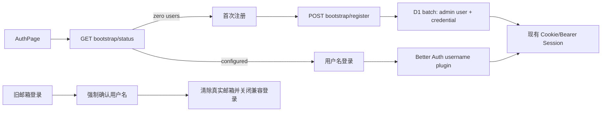

# 首次部署用户名认证改造

## Summary

将用户认证从“邮箱注册、邮件验证、邮箱登录”改为：

- D1 中没有用户时，`/auth` 显示首次部署注册页，填写用户名、显示名称和密码。
- 首个账号通过服务端原子创建，自动获得 `admin` 角色并立即登录。
- 首次注册完成后永久关闭公开注册，只保留用户名密码登录。
- GitHub 不再作为登录入口，仅允许登录后在账号设置中绑定。
- 旧邮箱密码账号可过渡登录一次，但必须确认或修改用户名；确认后永久关闭该账号的邮箱登录并将真实邮箱替换为内部占位值。
- 保留 Better Auth、现有会话、Machine API Key 和 Agent JWT 体系；D1 的 `email` 字段仅作为 Better Auth 内部兼容字段，不再作为用户可见身份。

## Implementation Changes

### 1. 数据模型与认证核心

- 新增迁移 `0047_username_auth.sql`：
  - 为 `user` 增加唯一 `username`、可选 `displayUsername` 和 `usernameConfirmed`。
  - 旧账号优先使用合法且不冲突的邮箱本地部分作为初始用户名；不合法或冲突时使用唯一的 `legacy_<user-id>`。
  - 旧账号标记为未确认；不删除 `email`、`emailVerified`、`verification`，以保持 Better Auth 和回滚兼容。
- 启用 Better Auth `username()`/`usernameClient()`：
  - 用户名转为小写，大小写不敏感且全局唯一。
  - 接受 3–64 个字符：字母、数字、点、下划线、连字符；首尾必须是字母或数字。
  - `requireEmailVerification: false`，删除邮件验证回调和验证邮件服务。
- 新建薄认证仓储层，使用 `D1 batch()` 原子写入首个 `admin` 用户及 `credential` 账号；密码仍调用 Better Auth 的哈希实现。
- 首账号使用固定内部邮箱，占用 `user.email` 唯一约束作为并发闸门：并发首次注册只能有一个成功，失败者得到 `409 SETUP_ALREADY_COMPLETED`。
- 若创建账号后会话创建失败，账号仍可立即通过用户名密码登录，不重复开放注册。

### 2. 公共接口与安全边界

新增接口：

- `GET /api/auth/bootstrap/status`
  - 返回 `{ registrationOpen, legacyEmailLoginEnabled }`。
- `POST /api/auth/bootstrap/register`
  - 请求 `{ username, name, password }`。
  - 仅零用户状态可用；成功返回现有 Better Auth 用户、Token 和 Cookie。
- `POST /api/auth/sign-in/legacy-email`
  - 请求 `{ email, password }`。
  - 仅允许具有 credential 且 `usernameConfirmed=false` 的旧账号；其他情况统一返回通用凭据错误。
- `PUT /api/auth/username`
  - 请求 `{ username }`，要求有效用户会话。
  - 原子更新用户名、标记已确认，并把旧真实邮箱替换为每用户唯一的内部占位邮箱。

服务端明确阻断公开调用：

- `/sign-up/email`
- `/sign-in/email`
- `/sign-in/social`
- `/send-verification-email`
- `/verify-email`
- `/admin/create-user`

保留登录后的 `/link-social` 和 OAuth callback，并把 GitHub 加入可信绑定提供方，允许内部占位邮箱与 GitHub 邮箱不同；未登录访问不能借此创建用户。

### 3. Web 界面与存量用户迁移

- 重构认证页为状态驱动的两种界面：
  - 未初始化：用户名、显示名称、密码及“Create owner account”。
  - 已初始化：用户名、密码及“Sign In”，无注册切换、邮箱验证和 GitHub 登录按钮。
- 存在未确认旧账号时，登录字段显示“Username or legacy email”；包含 `@` 时调用兼容接口，否则调用用户名登录。
- 旧账号登录后强制进入 Profile 页确认用户名；确认完成前不能进入 Board 等业务页面。
- Profile、Account、Header 和 Admin Users 页面统一显示用户名，移除邮箱及验证状态；用户名可在 Profile 中修改。
- Account 页保留 GitHub 绑定、密码修改和会话管理；credential 标签改为“Username/Password”。
- 删除 `/auth/verify` 路由、验证页面、验证状态组件与相关邮件配置；从 Wrangler 移除 `EMAIL` binding，但保留用于 Agent mailbox 的 `MAILS_ADMIN_TOKEN`。
- 更新认证规格、README 与本地部署文档，说明首次访问注册、注册锁定、旧账号确认流程及恢复方式。

## ADRs

### ADR-001：在 Better Auth 上使用用户名插件和内部邮箱

采用 Better Auth username 插件处理登录与会话，并保留不可见的内部邮箱满足其 credential 数据约束。相比重写认证适配器，此方案不破坏现有 Session、Admin、API Key、Agent Auth 和 OAuth 绑定；代价是数据库继续保留一个非用户身份的 `email` 字段。

### ADR-002：服务端单次 Bootstrap

注册资格由服务端数据库状态决定，首账号和 credential 使用 D1 batch 原子创建，前端状态只负责展示。相比仅隐藏注册按钮或依赖部署 Secret，这能防止直接 API 绕过，并减少首次部署步骤。

### ADR-003：逐账号退出旧邮箱登录

旧账号在确认用户名之前保留邮箱兼容登录；确认后立即清除真实邮箱并关闭该账号的邮箱入口。相比永久双登录或统一截止日期，此方案兼顾存量可用性与最终消除邮箱凭据。

## Test Plan

- 单元/API：
  - 零用户时开放注册；首账号为 admin、已确认且可立即登录。
  - 并发注册仅一个成功，后续注册及原 Better Auth 注册入口均被拒绝。
  - 用户名规范化、非法字符、长度和重复冲突。
  - 用户名正确/错误密码登录。
  - 旧邮箱账号迁移、兼容登录、强制确认、确认后邮箱失效和用户名生效。
  - GitHub 公共登录被拒绝，认证后的 GitHub 绑定仍可用。
  - 不生成 verification 记录、不调用邮件服务。
- E2E：
  - 首次部署注册页、注册完成后的登录页及无 GitHub/邮箱验证控件。
  - 旧账号一次性邮箱登录与用户名确认门禁。
  - Profile、Account、Header、Admin Users 的用户名展示。
  - 测试 helper 改为使用 Better Auth 密码哈希并直接创建隔离的 D1 credential fixtures，避免公开注册锁定破坏并行测试。
- 按 `ak-verify` 执行 Test author、前端 E2E author 和 Reviewer 分工；最终运行：
  - `pnpm build`
  - `pnpm typecheck`
  - `npx vitest run`
  - 相关 Playwright auth/settings/admin specs
- 不修改 deprecated daemon 代码，因此无需 daemon smoke test。

## Rollout and Assumptions

- 先应用加法迁移，再部署认证代码；不删除旧认证列和 verification 表。
- 上线前统计 OAuth-only 用户；本方案默认存量用户均有 credential。若发现 OAuth-only 用户，先为其补建 credential，不能继续保留 GitHub 登录入口。
- 回滚时 username 字段可保留；恢复旧代码前必须同时恢复 `EMAIL` binding。
- 首次注册是唯一公开用户创建入口；后续多用户邀请或管理员创建用户名账号不在本次范围内。
- UI 严格沿用 `DESIGN.md` 的 Geist、现有 surface token、cyan 交互色和现有输入/按钮组件。
