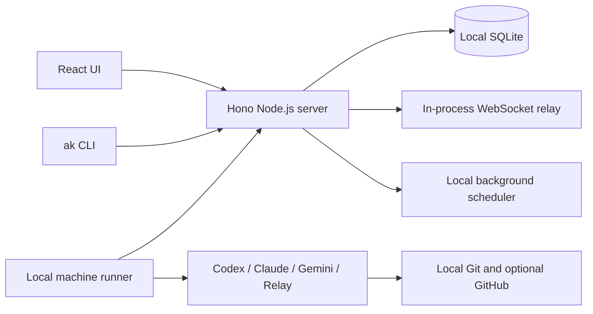

# Pure-Local Migration: Remove Cloudflare and AMA

Status: **planned, not started**

This document is an implementation plan only. Do not perform destructive
schema changes, delete compatibility code, contact AMA, or remove the old
Wrangler database until the applicable phase prerequisites and exit criteria
have been satisfied.

## Objective

Convert this fork from local-first to purely local:

- Run the React UI and Hono API on Node.js, without workerd or Miniflare.
- Store all application and Better Auth data in a directly managed local
  SQLite database.
- Run task dispatch, model discovery, chat relay, stale sweeps, and board
  maintainer scheduling locally.
- Remove Cloudflare deployment, D1, Durable Objects, Analytics Engine, Email
  bindings, Workers cron, Wrangler, and Cloudflare-specific types.
- Remove AMA provisioning, OIDC, runner downloads, cloud machines, cloud
  dispatch, catalog, vaults, triggers, memory stores, sessions, CLI modes, UI,
  types, configuration, dependencies, tests, and documentation.
- Keep local user authentication, Machine API Keys, Ed25519 agent identities,
  local Codex/Claude/Gemini/Copilot/Hermes runtimes, custom relay endpoints,
  board maintainers, and optional GitHub integration.

## Target Architecture



Recommended platform choices:

- Node.js 22 and `@hono/node-server` for HTTP, WebSocket upgrades, and static
  assets.
- `better-sqlite3` as the local SQLite driver. Use the same database connection
  for application repositories and Better Auth.
- `ws` for the in-process daemon/browser relay.
- A process-local, non-overlapping scheduler for stale sweeps and maintenance.
- A single local service instance, enforced by the existing service lock.

## Current Coupling

Cloudflare currently affects more than deployment:

- `apps/web/vite.config.ts` loads `@cloudflare/vite-plugin`.
- `apps/web/wrangler.toml` declares D1, Durable Objects, Analytics Engine,
  Email, Assets, cron, routes, and Cloudflare/AMA variables.
- `apps/web/worker/index.ts` is the HTTP and scheduled-event entrypoint.
- `apps/web/server/db.ts` exposes `D1Database` as the repository contract.
- `apps/web/server/betterAuth.ts` uses `kysely-d1`.
- `apps/web/server/tunnelRelay.ts` uses Durable Object WebSocket APIs.
- `apps/web/server/metrics.ts` and `metricsRepo.ts` use Analytics Engine.
- `service_runner.sh` still migrates through Wrangler and starts a
  Vite/workerd stack.

AMA currently affects:

- `apps/web/server/amaRuntime.ts`, `taskDispatch.ts`, `runtimeRouter.ts`,
  `runtimeCoordinator.ts`, and `modelCatalog.ts`.
- Agent creation/deletion, machine status, cloud-machine creation, session
  history, task metadata, chat routing, maintainer triggers, variables,
  memories, and run history.
- `packages/cli/src/amaRunner.ts`, `ak start --mode ama`, AMA login and
  credential environment handling.
- Shared runtime types and labels, including the `ama` agent runtime.
- Migrations beginning with `0022_ama_runtime_integration.sql`.

Important migration constraint: `ama_agent_sessions` is also used for local
agent sessions. It must be renamed and normalized, not blindly dropped.

## Phase 0 — Establish the Baseline

Before implementation:

1. Resolve or deliberately preserve the current uncommitted worktree. In
   particular, do not overwrite the in-progress local maintainer scheduler and
   related runtime-option changes.
2. Capture the current test baseline and local smoke result.
3. Inventory all persisted AMA records and active AMA-bound tasks/sessions.
4. Decide whether historical AMA data will be exported, retained as read-only
   generic history, or discarded explicitly by the owner.
5. Record the accepted architecture in an ADR before changing platform code.

Exit criteria:

- The implementation starts from a known revision and known test baseline.
- Existing unrelated user changes are not mixed into the migration.
- Historical-data handling has an explicit decision.

## Phase 1 — Introduce Platform-Neutral Boundaries

Make this phase behavior-preserving.

1. Replace direct repository references to the `D1Database` global with an
   application-owned `AppDatabase` contract covering only the operations the
   repositories use:
   - prepared statements and positional bindings;
   - `all`, `first`, and `run` results;
   - atomic batch/transaction execution;
   - migration state.
2. Split the current Worker `Env` into application services:
   - configuration;
   - database;
   - WebSocket hub;
   - background task launcher;
   - verification-email delivery;
   - metrics sink.
3. Wrap `executionCtx.waitUntil` behind the background-task interface.
4. Add contract tests for transaction rollback, batch atomicity, task claims,
   foreign keys, and result metadata.

Exit criteria:

- Business repositories and route handlers do not import Cloudflare database
  or execution-context types directly.
- The current runtime still passes its existing focused tests.

## Phase 2 — Make Runtime Routing Local-Only

1. Replace the public runtime-source vocabulary `ama | legacy` with `local`.
2. Add a compatibility migration:
   - rewrite `legacy` task bindings to `local`;
   - do not silently dispatch unfinished `ama` tasks locally;
   - require active AMA tasks to be resolved or explicitly archived;
   - preserve terminal AMA history according to the Phase 0 decision.
3. Simplify runtime availability to online local machine heartbeats.
4. Remove AMA preference and source failover from `runtimeRouter` and
   `runtimeCoordinator`.
5. Make the model catalog read only local heartbeat reports, including model
   capabilities and supported reasoning efforts.
6. Rename user-visible “legacy daemon” terminology to “local machine runner”.

Exit criteria:

- Assigning and executing a task never performs an AMA request.
- Local Codex/Claude/custom-relay model selection still works.
- Active AMA tasks are never replayed accidentally.

## Phase 3 — Replace AMA Maintainers Locally

Preserve board-maintainer behavior instead of deleting it.

1. Adopt `LocalMaintainerScheduler` as the only scheduler.
2. Store heartbeat/review configuration in SQLite and create ordinary local
   tasks for due runs.
3. Rename schema fields:
   - `ama_schedule_id` to `schedule_id`;
   - `last_ama_session_id` to `last_session_id`.
4. Remove AMA HTTP trigger, memory-store, board-vault, and trigger-run fields.
5. Derive maintainer run history from tagged local tasks.
6. Replace AMA variables with a local encrypted secret store if variable
   support is retained:
   - store the master key in a `0600` local file;
   - store versioned authenticated ciphertext in SQLite;
   - expose only the variables required by the target maintainer session;
   - never place plaintext secrets in logs or API responses.
7. Use repository-scoped `HEARTBEAT.md` or a generic local memory table for
   durable maintainer memory.

Exit criteria:

- Maintainers can be created, scheduled, paused, resumed, and deleted with AMA
  completely unavailable.
- Review and heartbeat triggers remain deduplicated and concurrency-safe.

## Phase 4 — Normalize the Database and API

Create forward-only SQLite migrations with preflight checks and backups.

1. Rename `ama_agent_sessions` to `agent_sessions` and retain local session,
   identity, usage, and cost data.
2. Remove or migrate:
   - `ama_owner_integrations`;
   - `agents.ama_agent_id`;
   - `machines.ama_environment_id`;
   - cloud machine rows and the `hosting = cloud` state;
   - AMA secret and credential references;
   - AMA maintainer columns;
   - AMA task-binding annotations.
3. Remove these API capabilities:
   - AMA provisioning;
   - cloud machine creation;
   - AMA session proxying;
   - AMA vault, trigger, memory, and cloud-run operations.
4. Rename session repository functions and response fields to generic local
   terminology.
5. Remove the AMA Better Auth OIDC provider while preserving email/password,
   Machine API Keys, agent auth, and optional GitHub OAuth.

Migration safety:

- Fail by default if active AMA resources exist.
- Offer an explicit export/archive operation; never infer consent to delete.
- Back up and checksum the source database before schema changes.
- Do not delete the source database after a successful migration.

Exit criteria:

- Runtime schema and public API no longer expose functional AMA resources.
- Existing local accounts, sessions, boards, tasks, agents, and machines remain
  usable.

## Phase 5 — Remove AMA from CLI, Shared Types, and UI

CLI:

1. Delete the AMA runner downloader/installer.
2. Remove `ak start --mode ama`; `ak start` always starts the local runner.
3. Remove AMA login, credentials, runner configuration, and control-plane
   environment variables.
4. Replace remaining `AMA_WORKSPACE*` compatibility paths with local
   `AK_WORKSPACE*` names where the behavior is still needed.

Shared types:

1. Remove `ama` from `AgentRuntime`, runtime arrays, runtime labels, cloud
   runtime sets, and aliases.
2. Remove AMA IDs and AMA-only response shapes.

Web UI:

1. Remove AMA connect/provision controls and cloud-machine creation.
2. Remove AMA runner, quota, cloud catalog, vault, trigger, and memory UI.
3. Route all live chat through the local session/tunnel implementation.
4. Keep custom relay endpoints for Claude-compatible Kimi/DeepSeek and other
   explicitly configured local/custom endpoints; those are not AMA.
5. Present maintainers exclusively as local scheduler configuration.

Exit criteria:

- No supported CLI or UI action downloads AMA or constructs an AMA request.
- All remaining runtime choices correspond to locally executable providers or
  explicitly configured relay endpoints.

## Phase 6 — Add the Node.js and SQLite Runtime

1. Add a Node.js Hono entrypoint using `@hono/node-server`.
2. Implement `AppDatabase` with `better-sqlite3`:
   - enable foreign keys;
   - set an appropriate WAL/busy-timeout policy;
   - implement atomic batch through SQLite transactions;
   - close the connection during graceful shutdown.
3. Give Better Auth the same SQLite database connection and remove
   `D1Dialect`.
4. Implement the local relay with `ws`:
   - authenticate before accepting an upgrade;
   - keep one active daemon socket per owner;
   - route browser sockets by session;
   - replace stale daemon connections safely;
   - persist authoritative events/history in SQLite so reconnect does not
     depend on in-memory state.
5. Replace Worker cron with a non-overlapping process-local scheduler for:
   - machine stale detection;
   - task stale/recovery sweeps;
   - dispatch-claim recovery;
   - board maintainer scheduling.
6. Replace Analytics Engine with structured local logs or SQLite aggregates.
7. Replace the Email binding with local verification-link logging; optional
   SMTP can be a separate future feature.
8. Serve production frontend assets from the Node process. For development,
   run Vite with API and WebSocket proxying to the Node server.

Exit criteria:

- The complete application works without starting workerd or Miniflare.
- HTTP, authentication, SSE, WebSocket, scheduling, and static-asset tests pass
  against the Node server.

## Phase 7 — Migrate Existing Local D1 Data

Add an explicit command similar to:

```bash
pnpm local:migrate --from-wrangler
```

Required behavior:

1. Locate the existing `.wrangler/state/v3/d1/**/*.sqlite` file, or accept an
   explicit source path.
2. Copy it to a timestamped backup and record a checksum.
3. Copy data into the new local path, for example
   `.local/data/agent-kanban.sqlite`.
4. Run the generic SQLite migrations.
5. Validate foreign keys, migration records, indexes, and row counts for
   critical tables.
6. Start the Node application in a read-only verification mode before normal
   startup.
7. Leave `.wrangler/state` untouched until the owner removes it manually.

Exit criteria:

- Existing authentication, boards, tasks, agents, machines, repositories, and
  local sessions survive the migration.
- Re-running the migration cannot overwrite an already migrated database
  without an explicit, separately confirmed operation.

## Phase 8 — Remove Cloudflare Artifacts

Only after the Node/SQLite runtime and data migration have passed acceptance:

1. Delete the Worker entrypoint, Wrangler configuration, Durable Object relay,
   Cloudflare metrics client, and Cloudflare deployment scripts.
2. Remove dependencies:
   - `@cloudflare/vite-plugin`;
   - `@cloudflare/workers-types`;
   - `wrangler`;
   - `kysely-d1`;
   - AMA SDK and runner dependencies.
3. Rewrite Vite configuration without the Cloudflare plugin.
4. Rewrite `service_runner.sh` and the systemd unit to manage the Node server
   and local runner only.
5. Replace Wrangler migration/reset scripts with local SQLite commands.
6. Remove Cloudflare/AMA smoke modes, fixtures, mocks, and deployment tests.
7. Update README, `docs/local-runtime.md`, architecture documentation,
   `AGENTS.md`, and public generated documentation.

Exit criteria:

- Package manifests and the lockfile contain no Cloudflare runtime, Wrangler,
  workerd, D1 adapter, or AMA dependency.
- Runtime source contains no Cloudflare binding type or AMA control-plane
  call.

## Verification Strategy

Each implementation phase must follow the repository `ak-verify` workflow:
Tests → Review → Regression. Do not defer all verification to the final phase.

Required coverage:

- `AppDatabase` contract tests using temporary SQLite files.
- Transaction and atomic task-claim concurrency tests.
- Migration tests using a fixture shaped like the current Wrangler SQLite
  database.
- Better Auth signup, verification, login, GitHub-optional, Machine API Key,
  and agent-auth tests.
- Node API route integration tests without Miniflare.
- WebSocket daemon/browser authentication, replacement, routing, reconnect,
  history, and shutdown tests.
- Scheduler non-overlap, restart, stale sweep, and maintainer deduplication
  tests.
- UI tests confirming all AMA/cloud controls are absent and local runtime
  status/model/reasoning options still work.
- Playwright against the Node/Vite local stack.
- Local daemon smoke covering registration, heartbeat, assignment, claim,
  worker spawn, review, completion, chat, and maintainer scheduling.

Final regression gates:

```bash
pnpm build
pnpm typecheck
npx vitest run
```

Run the updated local daemon smoke after installing the current CLI. Add a
source/dependency guard that rejects runtime reintroduction of:

- `@cloudflare/*`
- `wrangler`
- `D1Database`
- `DurableObject*`
- `@any-managed-agents/sdk`
- AMA control-plane environment variables and network endpoints

Historical migration documents may mention these names, so scope the guard to
runtime source, package manifests, active configuration, scripts, and current
user documentation.

## Key Risks and Mitigations

### Data loss during D1-to-SQLite migration

- Never migrate in place.
- Back up and checksum first.
- Keep the Wrangler database untouched.
- Compare row counts and run foreign-key checks.

### Replaying active AMA work locally

- Treat active AMA bindings as a blocking preflight condition.
- Require explicit archive/resolution rather than automatic source conversion.

### Breaking local sessions by dropping AMA tables

- Rename and normalize `ama_agent_sessions`; do not drop it before separating
  local and AMA data.

### Losing Durable Object relay behavior

- Preserve daemon replacement, session fan-out, reconnect, and history tests.
- Keep authoritative history in SQLite rather than the in-memory WebSocket hub.

### Scheduler duplication

- Keep the existing service single-instance lock.
- Add per-job non-overlap guards and database compare-and-set constraints.

### Secret regression when replacing AMA Vault

- Use a protected master key and authenticated encryption.
- Never persist or return plaintext values.
- Inject only task-scoped secrets into worker environments.

### Unreviewable big-bang change

- Keep phases independently testable.
- Do not combine AMA deletion, database migration, Node-server activation, and
  Cloudflare dependency deletion in one commit.

## Completion Definition

The migration is complete only when a clean machine can install and run Agent
Kanban locally without a Cloudflare or AMA account, token, binary, service, or
network call, while retaining the full supported local task lifecycle,
authentication, model discovery, reasoning settings, chat, maintainers,
repository operations, and optional GitHub integration.
